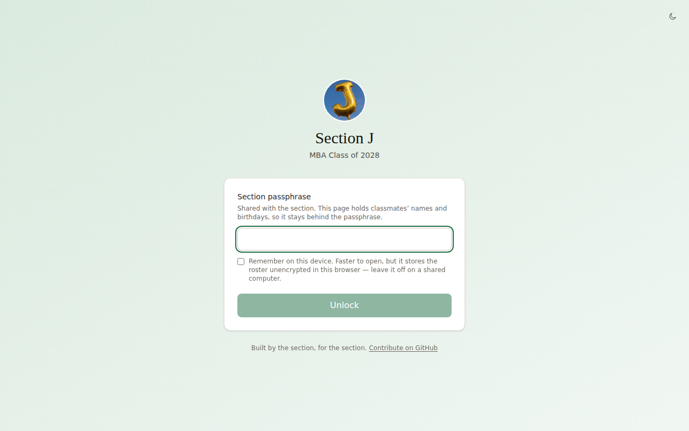
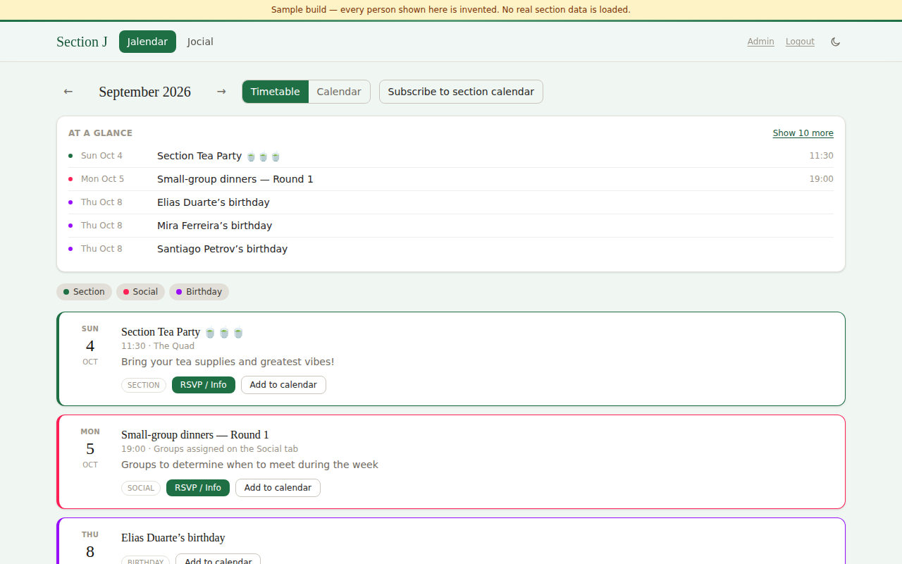
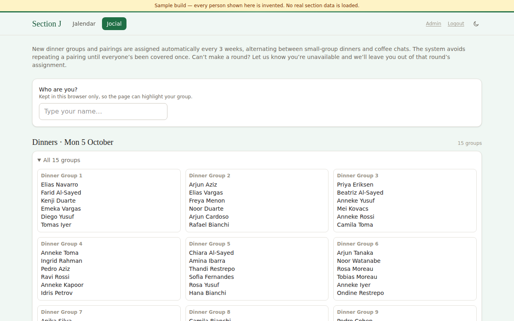

# Section Website Demo

A private group calendar, meetup allocator, and admin platform — originally built
for my MBA section, now a sanitized public copy for anyone to run. **Every person
in this repo is synthetic.** No real name, photo, contact detail, or personal data
of any real person exists anywhere in this codebase or its history.

<p align="center">
  
  
  
</p>

## What it does

- **Calendar** — section events, socials, and birthdays in a month grid or flat
  timetable, with an `.ics` feed you can subscribe to from any calendar app.
- **Meetup allocator** — assigns small-group dinners and 1:1 coffee chats on a
  rotation, minimizing repeat pairings until everyone's met once.
- **Admin panel** — trusted admins edit calendar events live (no PR needed),
  generate a new meetup round, and get push-notified. Every write commits
  straight to this repo via the GitHub API — the calendar's source of truth
  *is* the git history.
- **Email-to-calendar pipeline** — a Cloudflare Email Worker catches a
  forwarded calendar invite from the group's mailing list, parses the `.ics`
  attachment, and publishes it as a live event automatically.
- **Web Push** — real browser notifications (not a mock) when a new event goes
  up, deep-linking to that specific event.

## Why I built it this way

This started as "the section needs a calendar" and turned into an excuse to
work through a few problems I hadn't solved before:

- **How do you ship a roster of 90 people's personal data through a public git
  repo without ever putting the data in the repo?** The roster ships as
  AES-256-GCM ciphertext; the browser derives the decryption key from a
  passphrase (PBKDF2-SHA256, 600k iterations) and never sends it anywhere. The
  server holds no key — someone who finds the deployed URL without the
  passphrase gets encrypted bytes.
- **How far can you push "no backend, no database"?** The entire write path —
  admin edits, meetup rounds, calendar mutations — is Cloudflare Pages
  Functions + KV for instant reads, backed by direct commits to this repo's
  `data/events.json` for durability. There's no database; git is the database.
- **Can an inbox be a data-entry UI?** The email pipeline
  (`email-worker/`, `functions/api/ingest/event.ts`) turns "forward this
  invite to an address" into a published calendar event with zero human
  intervention — Cloudflare Email Routing → a Worker that extracts a `.ics`
  attachment → an authenticated ingestion endpoint that shares its write path
  with the admin panel, so the two can never disagree about what counts as a
  valid event.
- **Privacy by construction, not by policy.** `npm run check:leaks` scans
  every file before every push (and runs in CI on every PR) for anything that
  looks like real personal data. It's caught two genuine near-misses in the
  original project. Every contributor develops against a 90-person synthetic
  roster that mirrors the real one's sparsity — missing fields, missing
  photos, uneven data — so empty states are actually exercised, not just
  assumed to work.

## Tech stack

**Frontend:** React 19, TypeScript (strict), Vite, Tailwind v4, React Router
**Backend:** Cloudflare Pages Functions, Cloudflare KV, a standalone Cloudflare
Email Worker
**Data:** client-side AES-256-GCM + PBKDF2, Web Push (VAPID), GitHub Contents
API as a commit-backed data store
**Tooling:** Vitest-free by design — the meetup allocator and calendar logic
are framework-free TypeScript, runnable identically from a CLI script, the
browser, or a Cloudflare Function

## Running it locally

```bash
git clone https://github.com/thhenryhung/section-website-demo.git
cd section-website-demo
npm install
npm run dev
```

Open `http://localhost:5173` and unlock with the passphrase `demo`. You're now
looking at 90 fabricated people — that's the actual development environment
for this project; nobody who's worked on it has ever needed real data locally.

Plain `npm run dev` won't run the Cloudflare Functions (admin panel, push,
email ingestion) — see `npm run functions:dev` and `SETUP.md` for that, or
just read the source; it's the part I'm proudest of.

## A note on the data pipeline

`scripts/parse-cards.ts` and `scripts/browser/` were written to harvest
profile data from the section's own internal (SSO-gated, already
authenticated) member directory — data every member of the section could
already see about each other — with a documented opt-out and no data
collected beyond what the site actually uses. They're kept in this repo for
completeness but aren't wired into the demo build, which only ever runs
against the synthetic sample roster in `data/roster.sample.json`.

## Project layout

```
data/            events, courses, and the synthetic sample roster
email-worker/    standalone Cloudflare Worker: forwarded invite -> calendar event
functions/       Pages Functions — admin API, public events API, email ingestion
scripts/         data pipeline, meetup-pairing CLI, the leak-detection check
src/gate/        passphrase unlock and client-side decryption
src/lib/         crypto, pairing algorithm, calendar logic — framework-free
src/pages/       one file per tab, plus the admin panel
```

`CLAUDE.md`, `SETUP.md`, and `PRIVACY.md` are the working docs from the
original project — an operational runbook, a from-scratch setup guide, and a
privacy design doc written to be read by non-engineers. Left in as-is because
they're a more honest picture of how this was actually built and run than a
README alone would give.

## License

MIT — see [LICENSE](LICENSE).
